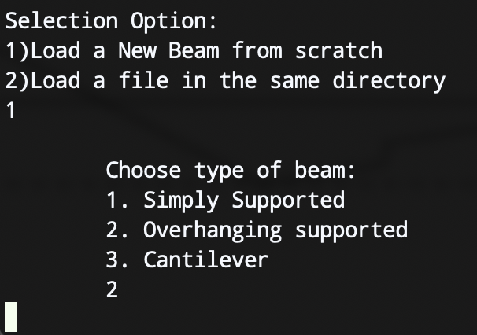
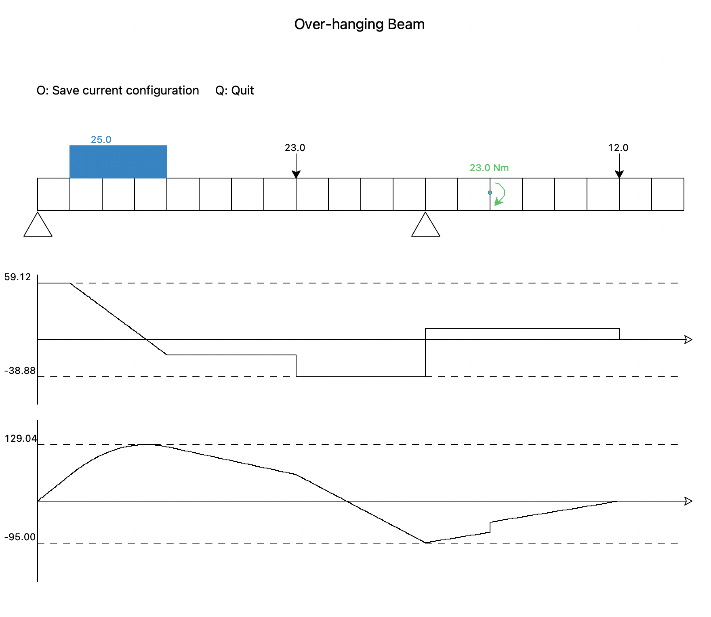

# Shear Force and Bending Moment Simulator GUI

Shear Force and Bending moment are key concepts in Solid Mechanics.

Shear force is the force acting on a substance in a direction perpendicular to the extension of the substance, acting in a direction to a planar cross section of a body.

Bending Moment is the reaction induced in a structural element when an external force or moment is applied to the element

## Objective

Display the shear force and bending moment on every point of a beam

functional requirements

1. Allow user to load or create a new Beam
2. 3 types of beam (simply supported, overhaing, cantilever)
3. 3 Types of forces (Point Weight, Distributed Weight, Bending Moment)
4. Allow user to place weight freely on the beam
5. Allow user to generate graphs based on beam configuration given
6. Allow user to save the configuration

## Executing the program

- Execute the program with following command

  ```shell
  python main.py
  ```

- Snippets of the program
  
  
